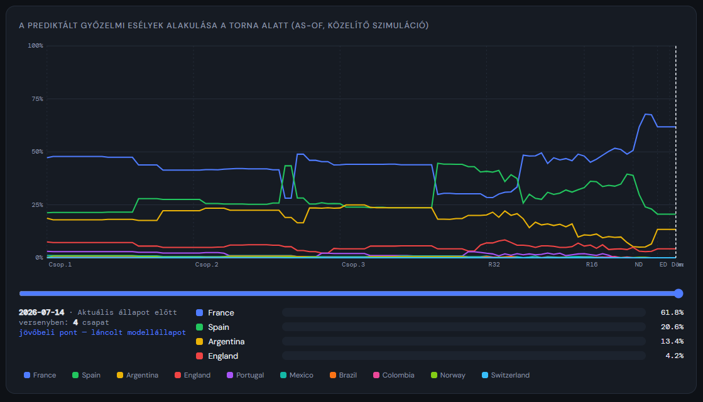

# WC2026 Predikciós Rendszer

Egy FIFA VB-2026 predikciós rendszer, ami **as-of** elven működik: bármelyik meccsre
visszaáll az adott pillanatba, és kizárólag az addigi eredményekből számol. A jövő
adata nem szivároghat vissza.

De ez a repo nem attól érdekes, hogy működik. Hanem attól, hogy **megmutatja, hol
nem működik.**

```bash
pip install fastapi uvicorn
python3 reproduce.py       # minden alábbi szám ellenőrzése, ~10 másodperc
python3 server_wc2026.py   # webfelület: http://localhost:8026
```

---

## ⚠️ ADAT-FIGYELMEZTETÉS — olvasd el, mielőtt bármit elhiszel

Ez a repo **nem megbízható VB-adatbázis.** Konkrétan:

- A `data_wc2026.py`-ben szereplő 100 meccseredményből **10-et vetettünk össze
  hivatalos forrással** — és abból a 10-ből **2 hamis volt** (Brazil–Norway 1–2, nem
  0–2; Argentina–Switzerland 3–1 rendes játékidőben, nem 0–3 hosszabbításban). A
  maradék 90 meccs `source: "dataset"` jelölésű: **ugyanabból a bizonytalan forrásból
  származik, és nincs hitelesítve.**
- A csapat-pontszámok (`star_player_score`, `squad_depth`, `coach_quality`)
  **generáltak**, és egymással **ρ ≈ 0,99** korrelációban mozognak. Ebből az adatból a
  „sztár vagy kollektíva?" kérdés **nem dönthető el** — a felület ezt ki is írja.
- Az eredmények hitelesítéséhez: `python3 official_data.py --fetch` (ingyenes kulcs a
  football-data.org-ról), majd `--verify` és `--sync`.

**A modell tanulságai ettől függetlenül állnak**, mert azok a modell *viselkedéséről*
szólnak, nem a konkrét csapatokról. De ha valós predikcióra használnád: előbb
hitelesítsd az adatot.

---

## Az eredmények (mind reprodukálható: `python3 reproduce.py`)

### 1. A beépített faktorok nagy részét a kalibráció megsemmisítette

15 paraméter, Brier-minimalizálás, szigorú tanító/teszt szétválasztással
(tanítás: csoportkör + R32 = 88 meccs; kiértékelés: R16 + negyeddöntők = 12 meccs,
amit az optimalizáló **soha nem látott**).

| Faktor | Eredeti → Kalibrált | |
|---|---|---|
| momentum: gólkülönbség | 0,04 → **0** | nullára |
| kontextus-skála (utazás / hőség / tapasztalat) | 1,0 → **0** | nullára |
| fejlődési forma (szint + trend) | 0 → **0** | nullán maradt |
| momentum: vereség | −0,05 → −0,003 | az eredeti **6%-a** |
| momentum: győzelmi sorozat | 0,15 → 0,009 | az eredeti **6%-a** |
| taktika-skála (kontra vs. labdabirtoklás) | 1,0 → **0,19** | **−81%, de nem nulla** |
| FIFA-rangsor súlya | 0,35 → 0,55 | +56% |

Ami maradt: **csapaterő + ELO.** Minden „okos" faktor zajnak bizonyult.

### 2. A naiv szabály megveri a modellt — találati arányban

| Módszer | Találat | Brier | Skill (BSS) |
|---|---|---|---|
| „Mindig a magasabb FIFA-pontszámú nyer" | **72,0%** | 0,560 | 0,000 |
| **A modell (kalibrált)** | 71,0% | **0,373** | **+0,334** |
| Csupasz alapmodell (erő + ELO) | 71,0% | 0,389 | +0,305 |
| Érmefeldobás | 44,0% | 0,620 | −0,107 |

Egy sornyi Excel-képlet jobb találati arányt ér el, mint a rendszer.

**De a naiv szabály mindig 100%-ot állít — nem tud bizonytalan lenni.** A modell
esélyt mond, és tudja, mikor bizonytalan: Brier 0,373 vs 0,560, **skill score +0,334**.

Ezért a felületen ma a **Brier Skill Score** a fő mérőszám, nem a találati arány.
A projekt lecserélte a saját mérőszámát, mert a rendszer bebizonyította, hogy rossz.

### 3. A döntetlen-vakság nem hiba — a mérőszám hibája

A modell 72 csoportmeccsből **egyszer** tippelt döntetlent (és eltalálta:
Paraguay–Australia). Közben 20 döntetlen volt.

Építettem egy **Poisson-gólmodellt**, ahol a döntetlen természetesen adódik a
gólvárakozásból. **Nem javított:** 70,0% / Brier 0,382 (az ELO: 71,0% / 0,373).

De megmutatta, miért: a döntetlen esélye **jól kalibrált** (átlag 21,1%, valós arány
27,8%). A legmagasabb döntetlen-esélyek 34–35% körül vannak. Csakhogy ahhoz, hogy a
döntetlen legyen a **legvalószínűbb** kimenetel, 33% fölé kell mennie **és** mindkét
csapaténál többnek lennie. Példa: Czechia–South Africa — döntetlen **35,2%**, favorit
**35,9%**. 0,7 százalékpont. Döntetlen lett.

**A 20 eltalálatlan döntetlen nem a modell hibája. A találati arány mint mérőszám
inherens plafonja.**

### 4. Egy LLM nem adatforrás

Az első verzió eredményeit egy nyelvi modell „gyűjtötte össze". A `gpt_news_cache.json`
fájlban a modell **maga írja le**, hogy nincs élő adathozzáférése — mégis adott
eredményeket, és **kettő közülük hamis volt**.

Megoldás: `official_data.py` — hivatalos API-forrás, `--verify` (a beépített adatok
összevetése a valósággal) és `--sync` (automatikus javítás). Az LLM szerepe leszűkült
arra, amiben jó: **valós, bemásolt hírcikkek értelmezése** (`gpt_updater.py --interpret`).

### 5. Mit tudok és mit nem

- A teszthalmaz **12 meccs.** A 83,3%-os teszt-találat 95%-os bootstrap
  konfidencia-intervalluma: **[58,3% — 100%]**. Ezt a rendszer kiírja magáról.
- A csapat-pontszámok kollineárisak (ρ≈0,99). A négy tényező-korreláció CI-je
  teljesen átfed — a sorrendjük statisztikailag nem megkülönböztethető.
- A „Sztárcentrikus" archetípus 3 csapatból áll, ±53%-os hibahatárral. Abból semmilyen
  következtetés nem vonható le, és a felület ezt közli is.

---

## A felület

| Nézet | Mit csinál |
|---|---|
| **Meccsek** | Idővonal 103 meccsel. Kattintásra as-of predikció (csak az addigi eredményekből), gombnyomásra a valóság: zöld = talált, sárga = szoros volt, piros = tévedett. |
| **▶ Teljes validáció** | Végigpörgeti mind a 100 lejátszott meccset, animált színezéssel. Fordulónkénti bontás + megbízhatósági görbe + bázisvonal-táblázat. |
| **⚖ Kalibráció** | Tanító/teszt kalibráció futtatása, jelentéssel. Ha csak a tanítón javul, kimondja, hogy túlillesztés. |
| **📈 Top5 idővonal** | A győzelmi esélyek alakulása a torna alatt, időcsúszkával. Látszik, ahogy Brazil görbéje a kiesés pillanatában nullára zuhan. |
| **🔬 Elemzés** | Sztár vs. kollektíva a valós eredményekből — konfidencia-intervallumokkal és a korlátok kimondásával. |
| **ELO / Poisson** | Motorváltó. A Poisson pontos eredményt is jósol (λ-alapú gólvárakozás). |
| **🔄 Eredmény-frissítés** | Hivatalos letöltés → ellenőrzés → javítás → cache-ürítés, egy gombbal. |



---

## Fájlok

| Fájl | Szerep |
|---|---|
| `reproduce.py` | **Minden publikált szám ellenőrzése egy paranccsal** |
| `predictor_wc2026.py` | A motor: erő, momentum, nyomás, forma, ELO + Poisson |
| `calibration.py` | Koordinátánkénti ereszkedés, tanító/teszt szétválasztás, bootstrap CI |
| `server_wc2026.py` | FastAPI: as-of predikció, validáció, bázisvonalak, BSS |
| `frontend_wc2026.html` | A felület (egyetlen fájl, külső könyvtár nélkül) |
| `official_data.py` | Hivatalos adatforrás, `--verify`, `--sync` |
| `data_wc2026.py` | ⚠️ Csapatok és eredmények — lásd az adat-figyelmeztetést |
| `gpt_news_cache.json` | Bizonyíték: itt írja le a nyelvi modell, hogy nincs élő adata |
| `termux_*.sh` | Futtatás Androidon, lokálisan |

## Futtatás telefonon (Termux)

```bash
bash termux_setup.sh   # egyszeri telepítés (pydantic v1 fallbackkel)
bash termux_start.sh   # -> http://localhost:8026
```

A motornak csak `fastapi` + `uvicorn` kell — se numpy, se pandas. A kalibráció és a
teljes idővonal-számítás telefonon is másodpercek.

---

## Licenc

MIT — lásd `LICENSE`.

## A tanulság

Egy predikciós rendszer első kérdése nem az, hogy hány százalék.
Hanem hogy **mihez képest** — és hogy a szám, amit nézel, egyáltalán a jó szám-e.
